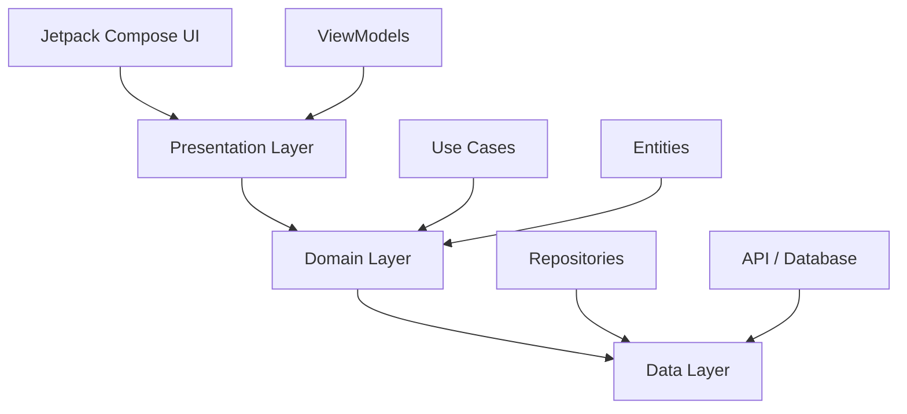

<div align="center">

# TOURLY

### *Connecting Travelers with Local Experiences*


**A unified full-stack platform bridging the gap between local excursion guides and travelers**

[Features](#features) • [Tech Stack](#tech-stack) • [Architecture](#architecture) • [Getting Started](#getting-started) • [Project Structure](#project-structure)

---

</div>

## Overview

**Tourly** provides a seamless interface for discovering unique tours, managing real-time bookings, and facilitating direct communication via low-latency messaging protocols. Whether you're a traveler seeking authentic local experiences or a guide wanting to share your expertise, Tourly makes it happen.

---

## Features

<table>
<tr>
<td width="33%" align="center">

### **Secure Authentication**
JWT dual-token mechanism with OAuth2 Google Sign-In integration

</td>
<td width="33%" align="center">

### **Smart Discovery**
Advanced filtering with real-time maps visualization of tour locations

</td>
<td width="33%" align="center">

### **Live Communication**
Real-time messaging via WebSockets for seamless guide-traveler interaction

</td>
</tr>
</table>

### Key Capabilities

- **Advanced Search & Filtering** - Multi-criteria search including price, dates, and categories
- **Real-time Booking Management** - Atomic seat updates with instant confirmation
- **Interactive Maps** - Live visualization of meeting points using Google Maps SDK
- **Smart Notifications** - Event-driven system for bookings and social updates
- **Enterprise-grade Security** - Encrypted preferences using Google Tink library
- **Modern UI/UX** - Reactive interface built entirely with Jetpack Compose

---

## Tech Stack

<div align="center">

### Mobile Environment (Android)


### Backend Infrastructure


</div>

---

## Architecture

Tourly follows **Clean Architecture** principles combined with **MVVM** pattern to ensure maintainability, testability, and separation of concerns.

<div align="center">



</div>

### Presentation Layer
- **Reactive UI** - Built entirely with Jetpack Compose using unidirectional data flow
- **State Management** - ViewModels leverage Kotlin Coroutines and StateFlow
- **Navigation** - Type-safe navigation routing for seamless transitions

### Domain Layer
- **Use Cases** - Pure business logic (`BookTour`, `ProcessVerification`, `FetchGuideDetails`)
- **Entities** - Framework-independent data models

### Data Layer
- **Repository Pattern** - Abstracts data sources (Remote API / Local Storage)
- **Data Transformation** - DTOs to Domain Entities mapping

---

## Security & Authentication

<table>
<tr>
<td width="33%">

#### JWT Implementation
Dual-token mechanism with stateless access tokens and persistent refresh tokens

</td>
<td width="33%">

#### OAuth2 Integration
Native Google Sign-In for streamlined user onboarding

</td>
<td width="33%">

#### Encryption
Sensitive data encrypted using Google Tink library

</td>
</tr>
</table>

---

## Real-time Communication

The messaging system is built on **STOMP over WebSockets**, providing:

- Low-latency message delivery
- Group chat support during excursions
- Typing indicators and read receipts
- Automatic reconnection on network changes
- Message persistence and synchronization

---

## Getting Started

### Prerequisites

```
Android Device Requirements
├── Android 8.0 (API 26) or higher
├── Google Play Services (for Maps & Authentication)
└── Internet connection
```

### Installation

**Option 1: Install APK**
1. Download the latest APK from the [Releases](https://github.com/yourusername/tourly/releases) page
2. Enable "Install from Unknown Sources" in your device settings
3. Open the downloaded APK file and follow the installation prompts

**Option 2: Build from Source**
1. Clone the repository
   ```bash
   git clone https://github.com/yourusername/tourly.git
   cd tourly
   ```

2. Open the project in Android Studio

3. Sync Gradle dependencies

4. Build and run on your device or emulator

---

## Project Structure

```text
Tourly/
│
├── app/                                       # Android Application
│   │
│   └── src/main/java/com/tourly/app/
│       │
│       ├── chat/                              # Real-time Messaging
│       │   ├── data/
│       │   │   ├── dto/                       # Data Transfer Objects
│       │   │   └── repository/                # Repository implementation
│       │   ├── di/                            # Dependency Injection
│       │   ├── domain/
│       │   │   ├── model/                     # Domain models
│       │   │   ├── repository/                # Repository interface
│       │   │   └── usecase/                   # Business logic
│       │   └── presentation/
│       │       ├── model/                     # Presentation models
│       │       ├── state/                     # UI state
│       │       ├── ui/components/             # Compose components
│       │       └── viewmodel/                 # ViewModels
│       │
│       ├── core/                              # Core Infrastructure
│       │   ├── auth/                          # Authentication logic
│       │   ├── data/
│       │   │   ├── mapper/                    # Data mappers
│       │   │   └── repository/                # Core repositories
│       │   ├── di/                            # Dependency Injection modules
│       │   ├── domain/
│       │   │   ├── model/                     # Core domain models
│       │   │   ├── repository/                # Repository interfaces
│       │   │   └── usecase/                   # Core use cases
│       │   ├── navigation/                    # Navigation routing
│       │   ├── network/
│       │   │   ├── api/                       # API service definitions
│       │   │   ├── mapper/                    # Network mappers
│       │   │   └── model/                     # Network models
│       │   ├── presentation/
│       │   │   ├── state/                     # UI state
│       │   │   ├── ui/
│       │   │   │   ├── components/            # Reusable components
│       │   │   │   │   └── foundation/        # Foundation components
│       │   │   │   ├── theme/                 # App theming
│       │   │   │   └── utils/                 # UI utilities
│       │   │   ├── util/                      # General utilities
│       │   │   └── viewmodel/                 # Core ViewModels
│       │   ├── storage/                       # Local storage (DataStore)
│       │   └── util/                          # Core utilities
│       │
│       ├── bookings/                          # Booking Management
│       │   └── presentation/ui/               # Booking UI screens
│       │
│       ├── create_tour/                       # Tour Creation
│       │   ├── data/
│       │   │   ├── dto/                       # Data Transfer Objects
│       │   │   ├── mapper/                    # Data mappers
│       │   │   └── repository/                # Repository implementation
│       │   ├── di/                            # Dependency Injection
│       │   ├── domain/
│       │   │   ├── exception/                 # Custom exceptions
│       │   │   ├── model/                     # Domain models
│       │   │   ├── repository/                # Repository interface
│       │   │   ├── usecase/                   # Business logic
│       │   │   └── validator/                 # Input validators
│       │   └── presentation/
│       │       ├── state/                     # UI state
│       │       ├── ui/components/             # Compose components
│       │       ├── util/                      # Presentation utilities
│       │       └── viewmodel/                 # ViewModels
│       │
│       ├── dashboard/                         # Guide Dashboard
│       │   └── presentation/
│       │       ├── state/                     # Dashboard state
│       │       ├── ui/components/             # Dashboard components
│       │       └── viewmodel/                 # Dashboard ViewModel
│       │
│       ├── home/                              # Home & Discovery
│       │   ├── data/
│       │   │   ├── dto/                       # Data Transfer Objects
│       │   │   ├── mapper/                    # Data mappers
│       │   │   └── repository/                # Repository implementation
│       │   ├── di/                            # Dependency Injection
│       │   ├── domain/
│       │   │   ├── repository/                # Repository interface
│       │   │   └── usecase/                   # Business logic
│       │   └── presentation/
│       │       ├── state/                     # Home state
│       │       ├── ui/components/             # Home components
│       │       └── viewmodel/                 # Home ViewModel
│       │
│       ├── login/                             # Authentication
│       │   ├── data/
│       │   │   ├── dto/                       # Login DTOs
│       │   │   └── repository/                # Auth repository
│       │   ├── di/                            # Dependency Injection
│       │   ├── domain/
│       │   │   ├── repository/                # Repository interface
│       │   │   └── usecase/                   # Auth use cases
│       │   └── presentation/
│       │       ├── state/                     # Login state
│       │       ├── ui/components/             # Login components
│       │       └── viewmodel/                 # Login ViewModel
│       │
│       ├── notifications/                     # Notification System
│       │   ├── data/
│       │   │   ├── mapper/                    # Data mappers
│       │   │   ├── remote/dto/                # Remote DTOs
│       │   │   └── repository/                # Repository implementation
│       │   ├── di/                            # Dependency Injection
│       │   ├── domain/
│       │   │   ├── model/                     # Notification models
│       │   │   ├── repository/                # Repository interface
│       │   │   └── usecase/                   # Notification use cases
│       │   └── presentation/
│       │       ├── ui/                        # Notification UI
│       │       ├── util/                      # Utilities
│       │       └── viewmodel/                 # Notification ViewModel
│       │
│       ├── onboarding/                        # User Onboarding
│       │   └── presentation/ui/               # Onboarding screens
│       │
│       ├── profile/                           # User Profile
│       │   ├── data/dto/                      # Profile DTOs
│       │   └── presentation/
│       │       ├── state/                     # Profile state
│       │       └── ui/components/             # Profile components
│       │
│       ├── reviews/                           # Tour Reviews
│       │   ├── data/
│       │   │   ├── dto/                       # Review DTOs
│       │   │   └── repository/                # Repository implementation
│       │   ├── di/                            # Dependency Injection
│       │   └── domain/
│       │       ├── repository/                # Repository interface
│       │       └── usecase/                   # Review use cases
│       │
│       └── settings/                          # App Settings
│           └── presentation/
│               ├── ui/components/             # Settings components
│               └── viewmodel/                 # Settings ViewModel
│
├── gradle/                                    # Gradle Configuration
│   └── wrapper/                               # Gradle wrapper files
│
└── Configuration Files
    ├── build.gradle.kts                       # Project build config
    ├── settings.gradle.kts                    # Project settings
    └── gradle.properties                      # Gradle properties
```

### Architecture Highlights

**Feature-based Modularization**: Each feature (chat, home, login, etc.) follows Clean Architecture with:
- `data/` - Repository implementations, DTOs, mappers
- `domain/` - Business logic, use cases, repository interfaces
- `presentation/` - UI, ViewModels, state management
- `di/` - Dependency injection modules

**Core Module**: Shared infrastructure including:
- Network layer (Ktor API clients)
- Authentication & security
- Navigation system
- UI theme & reusable components
- Local storage (DataStore)

**Dependency Injection**: Dagger Hilt for compile-time DI with feature-specific modules

---

## License

This project is licensed under the MIT License - see the [LICENSE](LICENSE) file for details.

---

## Author

**Borislava Ivanova**

[](https://github.com/B0rislava)
[](https://www.linkedin.com/in/borislava-ivanova/)
[](mailto:b.ivanova.bg@gmail.com)
